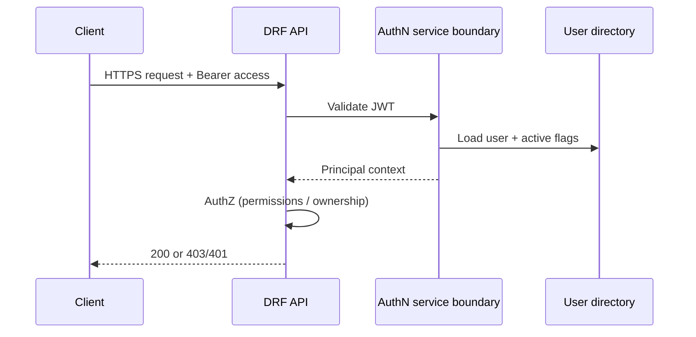
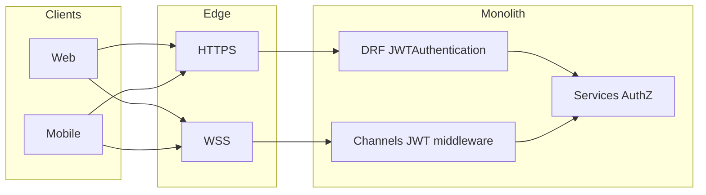

# Entercom — Authentication & RBAC Technical Architecture Specification

**Document type:** Architecture contract (non-code)  
**Scope:** Authentication, authorization (RBAC), security boundaries, audit expectations, WebSocket auth alignment, API conventions  
**Status:** MVP-ready specification; aligns with modular monolith (Django + DRF + Channels + Celery), PostgreSQL (Supabase), Redis, React (Vite) web, Expo mobile, Render / Vercel / EAS deployment  

**Version:** 1.0  
**Audience:** Backend, web, mobile, security, and platform engineers  

---

## Document control

| Aspect | MVP decision | Future scalability (documented only) |
|--------|----------------|----------------------------------------|
| Primary API auth | JWT (access + refresh) | Same; optional additional hardening layers |
| RBAC style | Permission-based roles; data-driven definitions | Finer-grained policies, org-scoped roles |
| Realtime auth | JWT-aligned WebSocket authentication (contract) | Same boundary; scaling via infra |
| Audit | Auth and security-sensitive events logged | Expanded retention, export pipelines |

---

# 1. Overview

## 1.1 Purpose of the authentication system

The authentication system establishes **who** is calling the Entercom platform—across REST, WebSockets, and background operations triggered by user context. It must:

- Identify principals (human users: customers, technicians, staff, managers, super admins) consistently.
- Issue **short-lived access tokens** and **rotating refresh tokens** suitable for web and mobile clients.
- Support **secure logout** and **token revocation** so compromised or abandoned sessions can be terminated.
- Remain compatible with a **modular monolith**: authentication is a cross-cutting concern with clear boundaries, not duplicated inside domain modules.

## 1.2 Purpose of RBAC

Role-Based Access Control (RBAC) establishes **what** an identified principal may do—at API boundaries, in the service layer, and where necessary at object level. It must:

- Encode **least privilege** and **deny-by-default** defaults.
- Separate **authentication** (identity) from **authorization** (permission checks).
- Support **staff and technician auditable actions** as a first-class requirement.
- Map product roles (Super Admin, Manager, Staff, Technician, Customer) to **permissions**, not to ad hoc checks scattered across views.

## 1.3 Why this architecture exists

Entercom is a **customer operations platform** with multiple surfaces (web, mobile, admin), **realtime** expectations, and **offline-tolerant** technician usage. A single modular monolith with JWT-based clients:

- Avoids premature distribution complexity while preserving **clear module boundaries**.
- Aligns with DRF and Channels as already chosen in the repository.
- Keeps **authorization rules** evolvable without rewriting every endpoint when new domains (bookings, payments, notifications) appear.

## 1.4 Scalability alignment

- **Horizontal scaling** of API workers and Channels consumers is an infrastructure concern; the **contract** (JWT claims shape, permission codenames, audit fields) stays stable.
- **Role and permission definitions** remain data-driven so new capabilities add **permissions** and **role assignments** rather than new authentication schemes.
- If parts of the system are ever extracted, **identity and permission contracts** (token claims, permission vocabulary) should remain backward-compatible for clients.

## 1.5 Modular monolith alignment

| Layer | Responsibility |
|-------|----------------|
| HTTP / DRF boundary | Parse credentials, reject unauthenticated traffic by default, attach `request.user` |
| Authorization helpers | Centralized permission evaluation (DRF permission classes call into shared evaluators) |
| Service layer | Enforce invariants, ownership, and cross-aggregate rules; raise domain-level denial when policy fails |
| Domain modules | Own data and use cases; must not embed alternate authorization schemes |
| Audit module | Append-only or append-oriented records for security-relevant events |

---

# 2. Authentication Architecture

## 2.1 JWT strategy (MVP)

| Element | Specification |
|---------|----------------|
| Format | JWT for access and refresh tokens (as provided by the adopted JWT stack in the monolith) |
| Transport | Access token: `Authorization: Bearer <access>` on REST. Refresh token: HTTPS-only exchange on dedicated endpoints; never logged in plaintext |
| Signing | Server-side secret or key material from environment; rotation procedure documented in operations runbooks (out of scope for this file) |
| Claims (contractual) | Stable subject identifier (user primary key), token type (access vs refresh), issued-at/expiry; optional stable **permission snapshot version** or **role version** only if explicitly chosen to balance staleness vs performance (MVP default: prefer short access TTL over heavy claims) |

**Repository alignment:** The codebase uses `rest_framework_simplejwt` with `JWTAuthentication` and refresh token blacklist support; lifetimes are environment-driven (e.g., access and refresh durations configurable via settings).

## 2.2 Access token lifecycle

| Policy | MVP specification |
|--------|---------------------|
| Lifetime | **Short-lived** (order of minutes; default target band **15 minutes** unless threat model requires shorter). Exact seconds are **environment-driven** |
| Use | Required for authenticated REST calls unless a documented public exception exists |
| Renewal | Obtain a new access token using a valid refresh token via the refresh contract (see §2.3) |
| Storage (clients) | Access token stored in memory-first strategies where feasible; platform docs should warn against insecure persistent stores on shared devices |

## 2.3 Refresh token lifecycle

| Policy | MVP specification |
|--------|---------------------|
| Lifetime | Longer than access (e.g., **days** range, **environment-driven**) |
| Rotation | **Rotating refresh tokens:** each successful refresh issues a new refresh token and invalidates the previous refresh token family as defined by the JWT library policy |
| Reuse detection | If an old refresh token is presented after rotation, treat as potential theft: **revoke related tokens** and require re-authentication (policy level—implementation follows library capabilities) |

## 2.4 Token rotation

- Rotation is **mandatory** for refresh tokens in MVP to reduce replay window.
- Access tokens are **not** rotated independently; they expire and are re-issued via refresh.

## 2.5 Token revocation and blacklist

| Mechanism | MVP specification |
|-----------|---------------------|
| Refresh blacklist | Supported at the persistence layer backing the JWT stack (e.g., outstanding refresh records blacklist) |
| Logout | Refresh token presented for revocation; server blacklists refresh token and ensures access token becomes useless within its short TTL |
| Emergency revocation | User-level or device-level revocation lists may be introduced later; MVP minimum is refresh blacklist + password change invalidation policy (see §6) |

## 2.6 Secure logout

Logout must:

1. Invalidate refresh token(s) on the server (blacklist / revoke).
2. Instruct clients to **delete local copies** of access and refresh tokens.
3. Emit an **audit event** (successful logout, principal, request metadata).

Clients must assume access token remains valid until expiry unless paired with server-side deny lists (optional future enhancement).

## 2.7 Session invalidation philosophy

The platform is **JWT-first**, not classic server session-first:

- **Server-side session** may exist for Django admin or legacy paths, but **client API** authentication is JWT-centric.
- Invalidation is primarily **refresh-token revocation** plus **short access TTL**.
- Password reset and privilege downgrade must trigger **refresh invalidation** policy (see §6 and §8).

## 2.8 Mobile and web authentication strategy

| Client | MVP expectations |
|--------|------------------|
| Web (Vite + TS) | Obtain tokens via HTTPS; prefer memory + secure patterns; avoid localStorage for long-lived refresh unless threat model accepts it—document chosen pattern in client security guidelines |
| Mobile (Expo) | Use secure storage primitives appropriate to OS; refresh rotation; handle app backgrounding and token refresh failures with re-login UX (no business workflow specified here) |
| CORS / credentials | Align with deployment: Vercel origins allowlisted; credentials policy consistent with cookie usage if any (JWT bearer default does not require cookies) |

## 2.9 API authentication flow (REST)



## 2.10 Offline-safe considerations (authentication only)

- Offline does **not** grant new server authority: cached access cannot mint new rights.
- Technician offline use relies on **already issued** credentials and **local UX**; when connectivity returns, **refresh** may be required before privileged server operations succeed.
- MVP avoids designing full offline sync; only **credential handling philosophy** is specified (see §10).

---

# 3. User Identity Model

## 3.1 Custom user model strategy

- Use a **single custom user model** as the canonical principal (`AUTH_USER_MODEL`), aligned with the repository’s email-based identifier strategy.
- All foreign keys to humans reference this model—not parallel identity tables.

## 3.2 Required user fields (contractual)

Fields are **architectural requirements**, not implementation code:

| Category | Required concepts |
|----------|-------------------|
| Identity | Unique email (login identifier for MVP); optional phone as secondary identifier if product enables it later |
| Names | Display name components as required by UX and audit (human-readable actor) |
| Security | Password hash (staff/manager/super admin; customers passworded as product requires), `is_active`, staff flags consistent with Django semantics where used |
| Timestamps | Created, updated (audit-friendly) |
| Login tracking | `last_login` (or equivalent) updated on successful authentication where policy requires |
| Role linkage | Logical association to `UserRole` / role definitions (see §4) |

## 3.3 Account statuses

| Status | Meaning |
|--------|---------|
| Active | May authenticate if other checks pass |
| Disabled / suspended | Must not authenticate; existing tokens should fail refresh and be audited |
| Pending verification | May be restricted to verification-only endpoints (product decision) |

## 3.4 Verification statuses

| Dimension | MVP |
|-----------|-----|
| Email verification | Recommended; state tracked explicitly (unverified vs verified) |
| Phone verification | Optional readiness: store state without mandating full MFA rollout |

## 3.5 Login and failed login tracking

- Record **successful** logins for audit and anomaly detection (timestamp, IP, user agent, request id).
- Record **failed** logins with **non-enumerating** responses where feasible (same error shape for unknown email vs bad password for customer-facing flows unless product requires otherwise for staff internal tools).

## 3.6 Soft delete strategy

- Prefer **soft delete** or `is_active=False` for user accounts that must retain referential integrity for historical records.
- Hard delete only via controlled administrative procedures with audit trail.

## 3.7 Account locking strategy

| Control | MVP specification |
|---------|-------------------|
| Brute-force | Progressive throttling / temporary lock after repeated failures (see §9) |
| Admin unlock | Super Admin or delegated security role may clear lock with audit |
| I now intentionally ignore this cos I think this is unnecessary as manual unlocking can be a security issue |

## 3.8 MFA readiness (future)

- Identity model reserves space for MFA factors **only as a product decision**; no mandatory MFA in MVP unless explicitly launched.
- Password reset and session revocation remain the **baseline** account recovery controls.

## 3.9 Account recovery readiness

- Password reset via verified channel (email link token with short TTL).
- Recovery events fully audited (see §8).

---

# 4. RBAC Architecture

## 4.1 Role hierarchy (logical)

The five MVP roles are **product roles**, not Django `Group` names unless intentionally mapped. Logical hierarchy for **authority** (higher rows supersede lower for platform administration tasks):

| Order | Role | Nature |
|-------|------|--------|
| 1 | Super Admin | Full platform administration within policy |
| 2 | Manager | Operational oversight; may manage staff-level access within scoped permissions |
| 3 | Staff | Day-to-day internal operations |
| 4 | Technician | Field / operational execution with restricted internal access |
| 5 | Customer | Self-service customer operations only |

**Note:** “Hierarchy” describes **authority for admin-style capabilities**, not inheritance of customer data access. Customers do not inherit staff powers.

## 4.2 Permission model

- **PermissionDefinition:** atomic, stable **codename** (slug) with human label and description—serves as the vocabulary for all modules.
- **RoleDefinition:** named role grouping with many-to-many permissions.
- **UserRole:** assigns roles to users; uniqueness constrained per (user, role).

New features **add permissions** and map them to roles; avoid role explosion.

## 4.3 Permission assignment philosophy

- **Default deny:** missing permission means **forbidden**.
- **Role-first:** users receive roles; roles carry permissions. Exceptional per-user permission grants are **discouraged** in MVP to reduce drift (if needed, must be audited and rare).

## 4.4 API-level authorization

- DRF default should remain **authenticated** for protected resources.
- Explicit permission classes per endpoint family (read vs write vs admin).
- Permission classes **delegate** to centralized evaluators (see §4.7).

## 4.5 Object-level authorization

For resources with ownership or assignment (e.g., “technician may only mutate assigned work” when those domains exist):

- Object-level checks live in **service layer** entry points (primary) with DRF permission classes where they can access object cheaply (secondary).
- Never rely solely on URL shape or client-supplied IDs without server verification.

## 4.6 Service-layer authorization

Every mutating use case should pass through a service boundary that:

1. Confirms authentication context present.
2. Evaluates permission + object policy.
3. Executes state change.
4. Emits audit if required.

## 4.7 Authentication vs authorization

| Concern | Question | Typical layer |
|---------|----------|----------------|
| Authentication | Who is this? | DRF authentication classes |
| Authorization | Are they allowed? | DRF permission classes + service layer |

## 4.8 Centralized permission strategy

- **Single source of truth** for “does user U hold permission P?” callable from DRF, services, and management commands.
- Cached answers optional; cache invalidation must respect role assignment changes.

## 4.9 DRF permission class strategy

| Pattern | Rule |
|---------|------|
| Default | Deny unless explicitly opened (public health checks documented) |
| Read/write split | Different permission classes for safe reads vs dangerous writes |
| Admin tasks | Separate permission codenames; never infer from `is_staff` alone unless explicitly mapped for Django admin |

## 4.10 Service-layer validation strategy

- Views and serializers: **thin**—parse, validate shape, call service.
- Services: **authoritative** for rules that combine permissions with domain state.

## 4.11 Why authorization logic must not be scattered in views

| Risk | Impact |
|------|--------|
| Duplication | Same rule diverges across endpoints |
| Bypass | Alternate endpoint forgets check |
| Testing burden | Matrix explodes |
| Audit gaps | Inconsistent logging |

Centralization yields **one policy**, **consistent denials**, and **easier security review**.

---

# 5. Permission Enforcement Standards

## 5.1 How permissions are checked

1. Resolve authenticated user.
2. Load effective permission set (roles → permissions), with explicit super-admin override policy if used (see §5.4).
3. Evaluate required permission codename(s) for the operation.
4. For object-sensitive operations, evaluate ownership/assignment predicates.

## 5.2 Where permissions are checked

| Location | Responsibility |
|----------|----------------|
| DRF permission class | Coarse gate; cheap global checks |
| Service layer | Authoritative business authorization |
| Channels consumer | Must repeat authorization; cannot trust client events alone |

## 5.3 Ownership-based permissions

- **Owner** patterns apply primarily to customer self-data and possibly assigned technician work (when domain models exist).
- Staff may access customer data only with explicit permissions and **audit**.

## 5.4 Admin escalation

- **Super Admin** may perform destructive or cross-tenant (if multi-tenant ever introduced) operations only via explicit permissions, not implicit “knows URL.”
- **Manager** cannot grant Super Admin rights unless explicitly permitted by permission matrix.

## 5.5 Technician restrictions

Technicians:

- Must not access internal financial or HR admin surfaces unless explicitly granted.
- Field operations should use **least privilege** permission sets scoped to assignments (future domain linkage; contract only here).

## 5.6 Secure defaults

- `IsAuthenticated` baseline on private APIs.
- Explicit `AllowAny` only for documented endpoints (health, login, password reset request, etc.).

## 5.7 Deny-by-default philosophy

If a new endpoint is added without an explicit permission decision, it must **fail closed** (forbidden) for non-public routes.

## 5.8 Auditability requirements

Any **permission elevation**, **role change**, or **cross-customer access** by internal roles must generate audit events (see §8).

---

# 6. Authentication Flows

Each flow below is a **contract**: request lifecycle, validation, security, audit, and token expectations—without prescribing serializers or views.

## 6.1 Registration

| Stage | Requirements |
|-------|----------------|
| Request | Client submits identity and credential material over HTTPS |
| Validation | Email uniqueness, password policy, rate limits |
| Security | No token issuance until email verification policy satisfied (recommended MVP default) |
| Audit | Account created event (non-sensitive metadata) |
| Tokens | Optional: if product issues tokens immediately, document risk; default recommendation is verify-then-issue |

## 6.2 Login

| Stage | Requirements |
|-------|----------------|
| Request | Credentials over HTTPS |
| Validation | Active user, password verification, verification flags |
| Security | Throttle failures; uniform errors where required |
| Audit | Success and failure events (failure without leaking account existence where policy requires) |
| Tokens | Issue access + refresh per JWT policy |

## 6.3 Logout

| Stage | Requirements |
|-------|----------------|
| Request | Present refresh token for revocation endpoint |
| Validation | Token belongs to caller |
| Security | Blacklist refresh; client clears storage |
| Audit | Logout event |

## 6.4 Refresh token

| Stage | Requirements |
|-------|----------------|
| Request | Valid refresh token |
| Validation | Not expired, not blacklisted, user still active |
| Security | Rotate refresh; detect reuse |
| Audit | Optional high-volume sampling vs full log—product chooses; security incidents always log |
| Tokens | New access + new refresh |

## 6.5 Forgot password

| Stage | Requirements |
|-------|----------------|
| Request | Email (or identifier) submission |
| Validation | Rate limit; do not leak whether email exists (customer-facing) |
| Security | One-time token with short TTL; single use |
| Audit | Request received (metadata only if enumeration-safe) |

## 6.6 Password reset

| Stage | Requirements |
|-------|----------------|
| Request | Token + new password |
| Validation | Token valid, password policy |
| Security | Invalidate refresh tokens for that user (policy: **mandatory** recommendation) |
| Audit | Password changed |

## 6.7 Email verification

| Stage | Requirements |
|-------|----------------|
| Request | Verification link or code |
| Validation | Token TTL; single use |
| Security | Prevent reuse across accounts |
| Audit | Email verified event |

## 6.8 Optional MFA (future flow)

| Stage | Requirements |
|-------|----------------|
| Enrollment | Second factor binding with recovery codes policy |
| Login | Step-up challenge after password success |
| Audit | MFA enrolled, MFA disabled, failed MFA |

---

# 7. WebSocket Authentication Strategy

## 7.1 Problem statement

REST uses **Bearer JWT** with DRF. Channels’ default **`AuthMiddlewareStack`** populates `scope["user"]` from **Django session / cookie-based** authentication, which **does not** automatically authenticate SPA or mobile clients that only hold JWTs.

This is a **contractual conflict**, not merely an implementation detail.

## 7.2 JWT WebSocket authentication architecture (MVP contract)

| Decision | Specification |
|----------|----------------|
| Goal | `scope["user"]` reflects the same principal as a valid REST JWT would |
| Approach | Introduce a **JWT-aware ASGI middleware** ahead of routing that validates access (or dedicated WS token) and attaches the user to scope |
| Token source | **Recommended:** subprotocol, `Sec-WebSocket-Protocol`, or first-message **only if** threat-reviewed; query string tokens are **discouraged** (leakage via logs and Referer). Exact choice documented in WebSocket client guidelines |

## 7.3 Why default `AuthMiddlewareStack` is insufficient

- It does not parse `Authorization` headers for WebSocket handshakes in the typical browser pattern.
- Mobile and web JWT clients therefore appear **anonymous** despite valid REST sessions.

## 7.4 Recommended middleware direction

- ASGI middleware that:
  1. Extracts JWT per chosen transport policy.
  2. Validates signature, expiry, user active flags.
  3. Sets user on scope.
  4. Fails closed (close connection with defined error code policy) on invalid tokens.

## 7.5 Handshake strategy

- Validate **before** `connect()` accepts sensitive subscriptions.
- Consumers remain responsible for **authorization** (permission checks), not only authentication.

## 7.6 Connection validation philosophy

- Treat every connection as **untrusted** until middleware authentication succeeds.
- Re-validate permission on **subscription-changing** events if the protocol supports dynamic topics.

## 7.7 WebSocket session invalidation philosophy

- Access token short TTL bounds exposure.
- On logout or refresh revocation, existing WS connections should be **closed** or forced to re-handshake on next message boundary (policy choice documented for clients).

## 7.8 Unifying REST and Channels authentication



Both entry points must converge on the **same user identity** and **same permission evaluators**.

---

# 8. Audit Logging Architecture

## 8.1 Immutable logging philosophy

- Audit records are **append-oriented**: corrections happen via compensating entries, not silent edits, except strictly controlled admin tooling with its own audit trail.

## 8.2 Auth actions that must be logged

| Event | Minimum fields |
|-------|----------------|
| Login success | User id, timestamp, IP, user agent, request id |
| Login failure | Reason code (internal), generic external message, IP, user agent |
| Logout | User id, timestamp |
| Token refresh | User id (sampled optional if volume high—security team decides) |
| Password reset request | Target identifier handling enumeration policy |
| Password reset complete | User id |
| Email verified | User id |
| Role assignment change | Actor id, target user id, old/new roles |
| Permission definition change | Actor id, change summary |
| Suspicious activity | Heuristic label, evidence metadata |

## 8.3 Actor identity

- Always store stable **user primary key** and human-readable label snapshot where useful for investigations.

## 8.4 Metadata expectations

- Correlate with HTTP `X-Request-ID` (or platform equivalent) for REST.
- WebSocket events should carry generated correlation id per connection or message batch.

## 8.5 Security event tracking

Failed logins, password resets, and role escalations feed **security monitoring** thresholds (implementation of monitoring out of scope).

---

# 9. Security Standards

## 9.1 Password policy

- Enforce Django password validators baseline; adjust minimum length per threat model.
- Forbid known-bad passwords where libraries exist.

## 9.2 Brute-force mitigation

- Rate limit authentication endpoints (throttle classes must be **wired**, not only configured as dormant rates).
- Progressive backoff or lockout per identity/IP heuristics.

## 9.3 Rate limiting philosophy

- **Stricter** limits on auth endpoints than general API.
- Authenticated users still subject to abuse protection where needed.

## 9.4 Refresh token theft mitigation

- Rotation + reuse detection (see §2.3).
- Short access TTL limits blast radius.

## 9.5 Replay mitigation

- JWT `exp` enforcement; reject skewed clocks within tolerance.
- One-time tokens for password reset and email verification.

## 9.6 CSRF considerations

- JWT bearer APIs are **not** CSRF-protected by cookies by default; avoid introducing silent cookie auth for API without explicit CSRF strategy.
- If cookie-based session is used for any surface, apply CSRF tokens for mutating requests.

## 9.7 HTTPS assumptions

- All token issuance and use over **HTTPS/WSS** in production (Vercel, Render, EAS builds).

## 9.8 Secret management

- Secrets only from environment or managed secret stores; **never** committed to git.
- `SECRET_KEY`, JWT signing keys, database URLs, third-party keys are **rotation-capable**.

## 9.9 Environment-driven production settings

| Requirement | Rationale |
|-------------|-----------|
| Production configuration from environment | Prevents accidental debug flags and enables identical images across stages |
| No hardcoded secrets | Prevents repository leaks and enables rotation |

## 9.10 Production hardening expectations

- Strong `SECRET_KEY` validation in production settings.
- Secure cookies if cookies used.
- Strict `ALLOWED_HOSTS` and CORS allowlists aligned to Vercel + mobile app origins.
- Optional: disable interactive API schema UI in production via configuration.

---

# 10. Offline Authentication Considerations (MVP)

## 10.1 Temporary offline technician usage

- Technician may continue to view **already fetched** operational context subject to client UX; **no new privileged server operations** until connectivity and valid tokens return.

## 10.2 Local credential handling philosophy

- Prefer OS secure storage for refresh token; avoid plaintext files.
- Access token may reside in memory; re-fetch on resume.

## 10.3 Secure caching expectations

- Cache **operational data** separately from **secrets**; never store refresh tokens in app logs.

## 10.4 Token expiration expectations

- Access expiry while offline: user continues read-only local UX; on reconnect, **silent refresh** or **re-login** based on refresh validity.

## 10.5 Offline sync security assumptions (bounded)

- MVP does **not** specify a full sync engine.
- Any future sync must **re-authorize** server-side per change, not trust client-side permission flags.

---

# 11. API Standards

## 11.1 Versioning

- All authenticated REST routes live under **`/api/v1/`** (matches repository convention).

## 11.2 Canonical authentication endpoint structure

Logical routes (names illustrate contract; routing table in implementation may alias or map equivalent handlers):

```text
POST   /api/v1/auth/login/
POST   /api/v1/auth/logout/
POST   /api/v1/auth/refresh/
GET    /api/v1/auth/me/
POST   /api/v1/auth/password/forgot/
POST   /api/v1/auth/password/reset/
POST   /api/v1/auth/email/verify/
```

**Repository alignment note:** The current modular monolith may expose JWT obtain/refresh/logout under paths such as `api/v1/auth/token/` consistent with SimpleJWT. Product standardization should converge public documentation and clients toward the **canonical** names above via URL configuration or thin wrappers **without changing token semantics**.

## 11.3 Consistent response format

| Case | Expectation |
|------|-------------|
| Success | Documented JSON body per endpoint family |
| Validation error | Structured field errors; no stack traces |
| Unauthorized | `401` with stable error code; no sensitive hints |
| Forbidden | `403` with stable error code; do not leak permission internals to customers unless policy allows |

## 11.4 Token refresh expectations

- Accept refresh token only on `POST /api/v1/auth/refresh/` (or current mapped path).
- Response returns new access token and rotated refresh token per policy.

## 11.5 `me` endpoint

- Returns non-sensitive profile summary and role/permission summary suitable for UI gating (exact shape documented in API reference, not here).

---

# 12. Future Scalability Considerations

| Future domain | How this auth/RBAC foundation helps |
|----------------|-------------------------------------|
| Notifications | Permissions gate who may subscribe and send; audit for mass actions |
| AI support assistant | AI receives **read-only approved** slices; permissions determine what can be read/exported |
| Bookings | Object-level authorization hooks already specified |
| Payments | High-risk permissions separated; dual-control policies can extend permission model |
| Technician assignment | Technician role + assignment predicates reuse same evaluators |
| Realtime updates | WebSocket JWT alignment ensures authorized subscriptions |
| Multiple admin tiers | New roles = new `RoleDefinition` rows + mappings |
| Microservice extraction | Stable JWT claims + permission vocabulary allow gateway or service boundaries to replicate checks |

---

# 13. Explicit Non-Goals

This specification **intentionally does not** define:

- Business workflows (booking steps, service request lifecycles, chat flows).
- AI prompt content, retrieval pipelines, or automation beyond auth boundaries.
- Payment orchestration, pricing, or settlement.
- Inventory, catalog, or supply chain rules.
- Advanced analytics models or BI schemas.
- Device hardware integrations (OBD, printers, etc.) beyond generic secure storage guidance.
- Full offline sync engine design.

---

# 14. Architectural Decisions Summary

| Decision | Rationale |
|----------|-----------|
| JWT over session for client APIs | Stateless horizontal scaling; native fit for mobile + SPA |
| Modular monolith | Velocity and simplicity with enforced module boundaries |
| DRF permissions + centralized evaluators | Consistent API gates without scattered logic |
| Centralized authorization | Safer mutations and clearer audits |
| Role-first RBAC | Operational clarity for five MVP personas |
| Audit-first for staff/technician | Compliance and incident response readiness |
| WebSocket JWT strategy | Eliminates REST vs Channels identity mismatch |
| Deny-by-default | Reduces accidental exposure as modules grow |

---

## Appendix A — MVP role contract matrix (authorization-oriented)

| Role | Primary responsibilities | Access boundaries | Restrictions | Allowed operations (examples, non-exhaustive) | Future scalability |
|------|-------------------------|-------------------|--------------|--------------------------------------------------|----------------------|
| **Super Admin** | Platform configuration, user lifecycle, security policy | Entire platform per assigned permissions | Must not bypass audit; destructive actions require explicit permission | Manage roles/permissions definitions, unblock accounts, view security logs | Split “platform admin” vs “security admin” tiers |
| **Manager** | Team oversight, operational KPIs, escalations | Internal dashboards scoped by permission set | Cannot redefine system-level permissions unless granted | Approve elevated actions where codified, manage staff workloads | Scoped org/region manager roles |
| **Staff** | Customer support and operations execution | Internal tools per permission | No super-admin configuration | CRUD on internal objects as permitted by codenames | Fine-grained desk roles |
| **Technician** | Execute assigned field work | Assigned resources + self profile | No broad customer PII outside assignment | Update job status within assignment, limited internal reads | Assignment-scoped permission templates |
| **Customer** | Self-service | Own account and owned customer data | No internal admin surfaces | Profile self-service, customer-permitted reads/writes | Household/org accounts with delegated access |

---

## Appendix B — Related repository artifacts (informative)

- Django settings: JWT lifetimes, rotation, blacklist flags, `AUTH_USER_MODEL`, DRF authentication classes.
- Apps: `users`, `roles`, `authentication`, `audit_logs`, `websocket`.
- Deployment: Render (API), Vercel (web), EAS (mobile), PostgreSQL (Supabase), Redis.

---

**End of specification**
