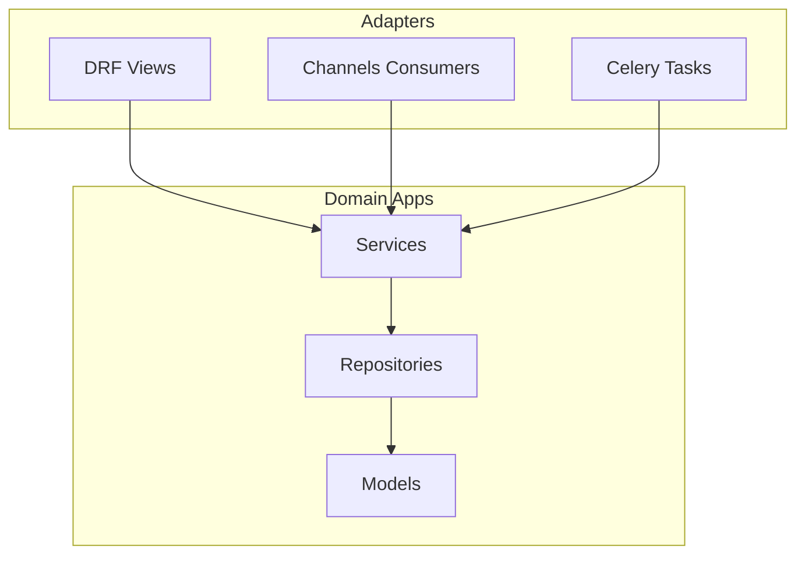

# Backend architecture

## Modular monolith

The API is a **single deployable** (Django) divided into **domain apps** under `backend/apps/`. Each app owns its persistence, HTTP/WebSocket adapters, and **service layer**. Cross-app orchestration uses explicit service calls or small application services in `backend/services/` — not circular imports between domain packages.

**Rationale:** A modular monolith optimizes for **MVP speed** and **operational simplicity** while preserving **clear seams** between domains. Extracting a service later (for example AI) is a boundary-preserving move, not a rewrite. See [ADR-001: Modular monolith](../decisions/adr-001-modular-monolith.md).

## Layer responsibilities

| Layer | Responsibility |
|-------|----------------|
| **Views / consumers / tasks** | Parse input, authentication and authorization checks, call services, map responses. **No** business rules. |
| **Serializers** | Validation shape and field-level constraints — **not** workflow rules. |
| **Services** | Use cases: transitions, invariants, orchestration, side effects. |
| **Repositories** | Query and persistence helpers; no HTTP; minimal logic. |
| **Models** | Schema, database constraints, simple properties. |
| **Permissions** | RBAC checks composable with DRF and Channels. |

## API versioning

- All REST routes live under **`/api/v1/`** (future `v2` as parallel include).
- OpenAPI is generated (drf-spectacular) for contract documentation.

## Service-layer architecture

Business workflows (requests, bookings, payments, assignments) must be **centralized in services** so that:

- The same invariants apply from REST, WebSockets, and Celery.
- Audit and verification hooks have a single entry path.

*Diagram suggestion:* sequence diagram from “HTTP POST” → `RequestService.transition` → repository → outbox/notifications.

## AI and payments (cross-links)

- **AI:** Read-only / advisory assistant in an **isolated** boundary; see [ADR-003: AI operational isolation](../decisions/adr-003-ai-boundaries.md).
- **Payments:** Server-verified Payment Provider webhooks; see [payments.md](payments.md).

## Operational security (non-auth)

Topics that complement [auth.md](auth.md):

- **Uploads:** Validate content type, size, and extension server-side; use Supabase Storage with backend-issued policies or signed URLs — never trust client-reported success alone.
- **Rate limiting:** DRF throttles; prefer Redis-backed throttles in multi-process production.
- **Transport:** Production HTTPS; `SECURE_SSL_REDIRECT`, HSTS, secure cookies when cookies are used.

## Deployment topology (summary)

| Component | Platform | Notes |
|-----------|----------|-------|
| API + ASGI + Celery | Render | Web service + worker; Redis managed or Render Redis |
| Web SPA | Vercel | Build `web/`; public env via `VITE_*` |
| Mobile | Expo EAS | `eas build` / `eas submit` |
| Database + file storage | Supabase | Postgres URL; Storage buckets |

**Migrations:** Run Django migrations in the **release phase** on Render (or a dedicated job) before traffic shifts.

**Observability:** Structured logging, error tracking (for example Sentry), and health endpoints — recommended hardening; document concrete choices when adopted.

Full operator-oriented steps: [../deployment.md](../deployment.md).

## Related documentation

- [frontend.md](frontend.md) — web/mobile boundaries and shared packages.
- [websocket.md](websocket.md) — realtime scope and envelopes.
- [notifications.md](notifications.md) — delivery paths and channel naming.
- [../workflows/request-lifecycle.md](../workflows/request-lifecycle.md) — intended lifecycle (implementation evolves with services).
