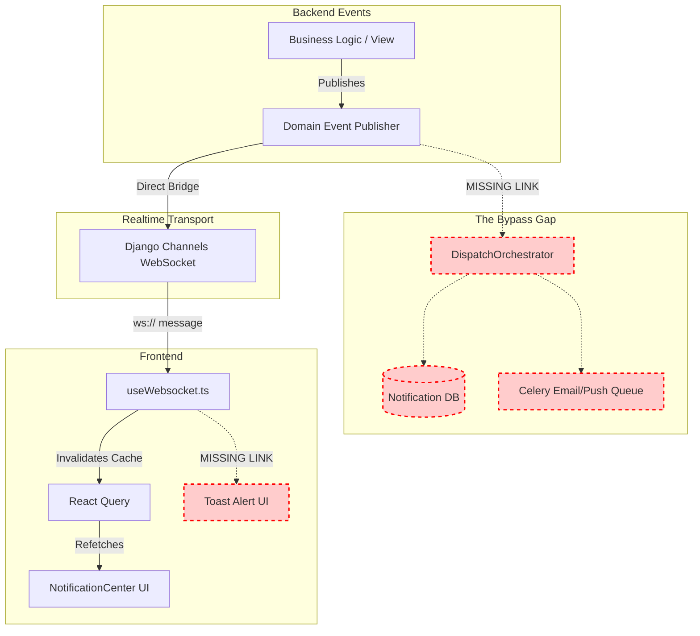

# Entercom Notification & WebSocket Production Readiness Audit

## 1. Executive Summary
This audit provides a comprehensive, deep-dive implementation assessment of the Entercom platform's Notification and WebSocket architecture, spanning the Django backend, Celery workers, Redis message broker, Django Channels, and the React/Vite frontend.

**Bottom Line:** The infrastructure foundations are robust and properly separated into distinct domains (e.g., Domain Events vs. Delivery vs. WebSockets). However, the implementation is incomplete. There is a **critical missing link** between Domain Events and the Notification Inbox. Domain Events currently bridge directly to WebSockets (for frontend cache invalidation) but completely bypass the `DispatchOrchestrator`, leaving the persistent inbox empty and the email/push delivery queues entirely idle. 

On the frontend, realtime cache invalidation works, but there are no visual toast notifications triggered by WebSocket events, leaving users blind to realtime updates unless they happen to be staring at the affected data grid.

## 2. Current Architecture

The architecture attempts to implement an Event-Driven notification system using the following components:
*   **Django Backend:** Domain services publish strongly-typed events via `EventPublisher` and `WebSocketEventPublisher`. 
*   **Django Channels / Redis:** Routes real-time events to authenticated WebSocket clients via `ConnectionManager`, `SystemConsumer`, and `RequestConsumer`.
*   **Celery:** Processes out-of-band delivery (Emails, Push) via `task_dispatch_email` and `task_dispatch_push`.
*   **React Frontend:** Connects to WebSockets via `useWebsocket.ts` which invalidates React Query caches (`useNotifications.ts`, `useRequests.ts`), triggering UI refreshes.

## 3. Backend Audit

### Domain Events
*   **Publishers:** `requests`, `bookings`, `orders`, and `payments` each have their own event dispatchers.
*   **Consumers:** The only active consumers are the `WebSocketEventPublisher` and `BookingWebSocketDispatcher` which push directly to Django channels.
*   **Bypass Issue:** The `DispatchOrchestrator.dispatch_event` method (which handles DB persistence and Email/Push queueing) is **never called** by the application logic. It is only invoked in `test_integration.py`. 

### Notification Pipeline Trace
Business Action -> Domain Event -> Event Bus -> WebSocket -> Frontend (Invalidates Cache)
**PIPELINE BREAK:** The Event Bus -> Notification Creation step is entirely missing. Therefore, Delivery Creation, Email, and Push steps are never reached.

### Notification Models
*   `Notification`: Fully implemented (category, event_type, status, polymorphism). Missing an `archived_at` timestamp.
*   `NotificationDelivery`: Implemented for idempotency and per-channel tracking.
*   `NotificationPreference`: Implemented.
*   `NotificationTemplate`: **Missing**. There is no template management for Emails.

### WebSocket Architecture
*   **Channels/Consumers:** Configured via `config/routing.py`. `SystemConsumer` and `RequestConsumer` are implemented.
*   **Authentication:** First-Frame JWT auth is correctly implemented in `ConnectionManager`.
*   **Heartbeat:** Backend expects a 60-second ping/pong timeout.
*   **Tenant/Role Isolation:** Handled in `RequestConsumer._is_authorized_for_request`.
*   **Missing Channels:** There are no dedicated channels for Orders, Payments, or Quotes.

### Celery
*   **Tasks:** `task_dispatch_email`, `task_dispatch_push`, `job_sweep_transient_failures`, `job_enforce_retention_policy` are defined.
*   **Retries:** Circuit breaker and exponential backoff are implemented.
*   **Gap:** Tasks are never enqueued because the Orchestrator is bypassed.

### Email & Push Implementation Status
*   **Email:** Currently uses a mocked `_send_email_mock` function. Real provider (SendGrid/SES) is missing. Template support is missing.
*   **Push:** Currently mocked. FCM/Device registration models are completely missing.
*   **SMS:** Not implemented. Not strictly required for MVP, but good for offline technician alerts in the future.

## 4. Frontend Audit

### Implemented Features
*   **API Layer:** `api/notifications.ts` and `hooks/useNotifications.ts` fetch and mark notifications as read.
*   **WebSocket Provider:** `useWebsocket.ts` manages connection and cache invalidation.
*   **UI:** `NotificationCenter.tsx` (Bell Dropdown) and `NotificationPreferences.tsx`.

### Critical Frontend Gaps
1.  **No Visual Realtime Alerts:** WebSocket events invalidate queries but **do not** trigger `ToastContainer` alerts. Users get no visual cue when events arrive.
2.  **No Notification Pagination:** `getNotifications()` fetches ALL notifications without limit, offset, or cursors. This will cause severe memory and performance issues.
3.  **No Heartbeat / Ping:** The frontend does not send `ping` frames. The backend heartbeat monitor will silently close the connection after 60s of inactivity, and the frontend will constantly reconnect.
4.  **No Exponential Backoff:** Reconnect logic uses a hardcoded 5-second delay, which will hammer the server during an outage.
5.  **Token in URL:** `useWebsocket.ts` passes the JWT as `?token=<jwt>`, exposing it in browser history and proxy logs.
6.  **Duplicate Connections:** `PortalLayout`, `RequestDetail`, and `StaffRequestDetail` each call `useWebsocket`, resulting in multiple concurrent WebSocket connections per user.

## 5. Event Catalog

### Requests Domain (`apps.requests.events`)
`request.created`, `request.updated`, `request.submitted`, `request.status_changed`, `request.cancelled`, `request.assigned`
`quote.created`, `quote.approved`, `quote.rejected`, `quote.revision_requested`, `quote.expired`
`assignment.accepted`, `assignment.declined`, `assignment.timeout`
`verification.submitted`, `verification.approved`, `verification.rejected`, `verification.overridden`
`escalation.triggered`, `escalation.resolved`, `sla.warning`, `sla.breached`

### Bookings Domain (`apps.bookings.events`)
`booking.created`, `booking.scheduled`, `booking.rescheduled`, `booking.duration_extended`, `booking.in_progress`, `booking.completed`, `booking.cancelled`, `booking.no_show`, `booking.reminder_sent`
`availability.working_hours_updated`, `availability.blackout_created`, `availability.blackout_deleted`

### Orders & Payments Domain (`apps.orders`, `apps.payments`)
`order.created`, `order.cancelled`, `order.fulfilled`
`payment.initialized`, `payment.paid`, `payment.failed`, `payment.cancelled`, `payment.expired`
`webhook.received`, `webhook.rejected`

## 6. Notification Flow Diagram

## 7. Security Findings

*   **First-Frame Auth:** Securely implemented in Django Channels.
*   **JWT Exposure (Frontend):** 🔴 High Risk. The JWT is passed as a query parameter in `useWebsocket.ts`. Must be moved to a subprotocol header (`Sec-WebSocket-Protocol`) or sent as the first frame payload.
*   **Notification Ownership:** 🟡 Medium Risk. Frontend does not strictly validate if a notification belongs to a user before interacting with it (relies entirely on backend enforcement).
*   **Event Leakage:** 🟡 Medium Risk. `SystemConsumer` broadcasts system-wide events; must be audited to ensure no PII or sensitive request data leaks into global groups.

## 8. Performance Findings

*   **N+1 Notifications (Frontend):** 🔴 High Risk. `getNotifications()` has no pagination.
*   **N+1 Mutations (Frontend):** 🔴 High Risk. "Mark All Read" triggers `N` concurrent API calls instead of a single batch endpoint.
*   **Connection Flooding:** 🟡 Medium Risk. Multiple instances of `useWebsocket` per user cause redundant connections. Fixed 5s reconnect delay will cause server stampedes.
*   **Polling Overlap:** 🟡 Medium Risk. `useNotifications.ts` relies on a 30-second polling interval while WebSockets are active, doubling database load.

## 9. Missing Features
*   **Event Orchestration:** Bridging Domain Events to persistent `Notification` models.
*   **Frontend Toast Integration:** Tying realtime events to visual popups.
*   **Email Templates & Provider Integration:** Real SMTP/API sending.
*   **Push Infrastructure:** Service workers, device tokens.

## 10. Prioritized Implementation Roadmap

### Priority 1: Critical Blockers (The Bypass Issue)
1.  Refactor Backend Event Publishers (`requests`, `bookings`, `orders`, `payments`) to route events through `DispatchOrchestrator.dispatch_event`.
2.  Refactor Frontend `useWebsocket.ts` to be a singleton Context Provider to eliminate duplicate connections.
3.  Implement Frontend WebSocket Ping/Heartbeat to prevent silent connection drops.

### Priority 2: Realtime UI Parity
1.  Connect `useWebsocket.ts` to the `toastStore` to surface visual alerts for incoming events.
2.  Implement a `/notifications/mark-all-read/` batch endpoint on the backend and update the frontend UI.
3.  Add cursor-based or offset pagination to `getNotifications()`.

### Priority 3: Email Integration
1.  Implement `NotificationTemplate` models for dynamic email rendering.
2.  Replace `_send_email_mock` in Celery with a real provider (e.g., AWS SES or SendGrid).

### Priority 4: Push & SMS
1.  Deferred until Post-MVP. User preferences already support the schema, but device token registration is required before push can be supported.

## 11. Production Readiness Score

| Subsystem | Score (1-10) | Notes |
| :--- | :---: | :--- |
| **Domain Events** | 8 | Excellent taxonomy and separation of concerns. Missing Orchestrator link. |
| **Notification Pipeline** | 3 | Bypasses persistence entirely. Fails to reach delivery queues. |
| **WebSockets (Backend)** | 8 | Solid First-Frame auth, groups, and heartbeat tracking. |
| **Frontend** | 4 | Severe scaling issues (no pagination), no toasts, duplicate connections, URL JWTs. |
| **Email** | 2 | Mocked out. No templates. |
| **Push** | 1 | Schema exists, but no device tracking or service workers. |
| **SMS** | 0 | N/A (Not required for MVP). |
| **OVERALL READINESS** | **4 / 10** | **Not Ready for Production.** Requires Priority 1 and 2 fixes immediately. |
